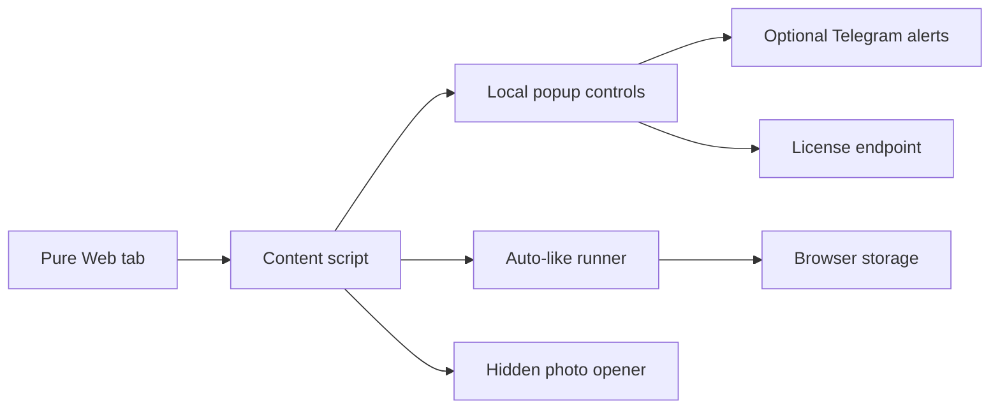

# PureAutoLike

<p align="center">
  
</p>

<p align="center">
  <strong>Beta browser extension for Pure Web: local auto-like flow, hidden photo opener, Telegram alerts, and subscription-ready license checks.</strong>
</p>

<p align="center">
  <a href="README.en.md"><strong>English</strong></a>
  ·
  <a href="README.ru.md"><strong>Русский</strong></a>
  ·
  <a href="INSTALL.md"><strong>Install</strong></a>
  ·
  <a href="PRIVACY.md"><strong>Privacy</strong></a>
  ·
  <a href="SECURITY.md"><strong>Security</strong></a>
  ·
  <a href="FEEDBACK.md"><strong>Feedback</strong></a>
</p>

<p align="center">
  
  
  
  
</p>

PureAutoLike keeps Pure Web automation inside the browser profile where Pure is
already open. It is built for one job: remove repetitive feed work without a
separate desktop app, extra tray process, or heavyweight control panel.

Keep Pure open. Let the boring likes run. React faster when something actually
happens.

## What It Does

| Feature | What it means |
| --- | --- |
| Fast auto-like flow | Finds visible Pure like controls and runs the local click flow inside the active browser profile. |
| Duplicate guard | Avoids re-clicking the same visible profile during the current session. |
| Hidden photo opener | Adds a page control for Pure hidden-photo placeholders when the active web session already has access. |
| Telegram alerts | Optional notifications for new Pure matches, likes, and messages. |
| Profile notes export | Optional local capture of visible status, age, and description, exported manually as Markdown. |
| Beta license check | Free beta access now, with a backend path ready for future paid subscription enforcement. |

<p align="center">
  
</p>

## Why It Is Small On Purpose

Generic autoclickers do not understand the Pure feed. Large desktop automation
apps add another process, another installation path, and another interface to
manage. PureAutoLike takes the smaller route: a focused WebExtension that runs
where the Pure session already lives.



## Browser Support

| Target | Status |
| --- | --- |
| Chrome / Chromium / Edge / Brave / Opera / Arc / Yandex Browser | Recommended build. |
| Firefox | Supported with DOM-click fallback. |
| Safari | Safari Web Extension source is included; Safari packaging is separate. |

The extension behaves inside the browser profile where it is installed. If Pure
is already used through a managed Chromium profile, PureAutoLike inherits that
profile's cookies, proxy, timezone, fingerprint, and network rules. It does not
provide anti-detect functionality by itself.

## Privacy Position

- Settings are stored in browser extension storage.
- Telegram bot token and chat id stay in extension storage and are sent only to
  Telegram Bot API when Telegram alerts are enabled.
- Profile status, age, and descriptions are stored locally only when the optional
  capture mode is enabled.
- The Pure authorization header can be observed inside the active Pure page at
  runtime for photo-opening requests, but it is not stored in extension settings.
- The extension does not include third-party analytics.

Read the full policy: [PRIVACY.md](PRIVACY.md)

## Beta And Future Paid Access

The current public build is beta. The extension already contacts a lightweight
PureAutoLike license endpoint, so beta access can be turned into paid access
later without shipping a completely different product model.

GitHub release ZIPs and Chrome Web Store builds can both check the license
endpoint. Local unpacked installs can still run extension code, but production
access can be controlled by the backend when beta mode is disabled.

## Important Limits

PureAutoLike reduces manual feed work. It does not guarantee matches, replies,
account reach, ranking, moderation state, or geolocation behavior inside Pure.
Use it responsibly and follow the rules of the services you use.

## Install

Public user distribution is planned through the Chrome Web Store beta listing.
GitHub is used for source transparency, feedback, and maintainer release
artifacts.

Maintainer notes: [INSTALL.md](INSTALL.md)

```bash
npm run build
npm run package
npm run validate
npm run audit:clean
```

Generated folders are written to `dist/`. Release ZIP files are written to
`packages/`.

## Public Marketing Notes

The GitHub presentation plan and generated image prompts are documented in
[docs/github-marketing-plan.md](docs/github-marketing-plan.md). Search/indexing
notes live in [docs/seo-indexing.md](docs/seo-indexing.md).

## Repository Shape

This repository intentionally contains the browser extension distribution plus
the lightweight license worker used for beta access and future subscriptions.
It is scoped as a browser-extension product, not a desktop automation suite.
