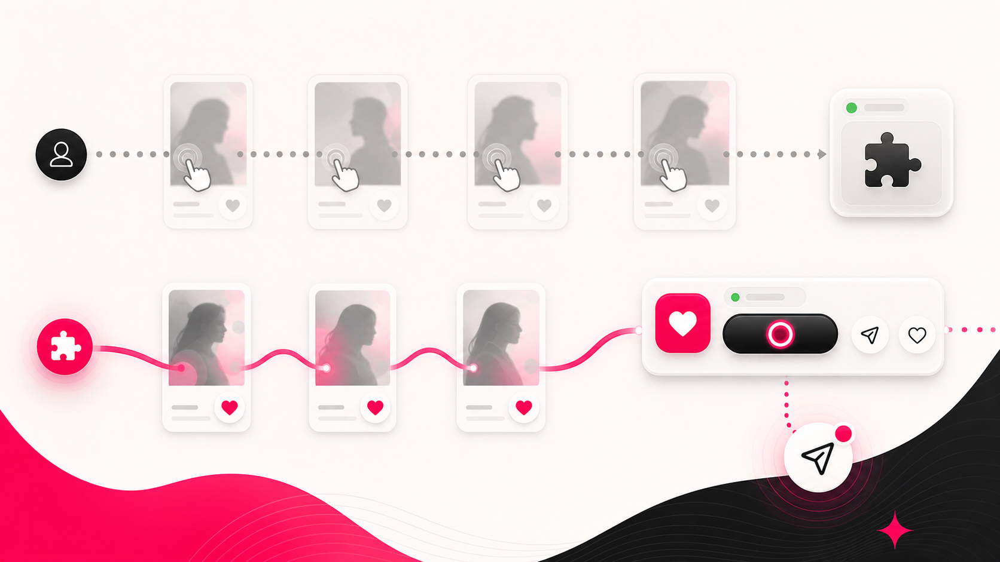

# PureAutoLike: быстрый автолайкер и открытие скрытых фото для Pure Web

  

  <a href="README.md"><strong>Главная</strong></a>
  ·
  <a href="INSTALL.md"><strong>Установка</strong></a>
  ·
  <a href="PRIVACY.md"><strong>Приватность</strong></a>
  ·
  <a href="FEEDBACK.md"><strong>Обратная связь</strong></a>

PureAutoLike - легкое beta-расширение для Pure Web. Оно сделано для тех,
кому нужен быстрый автолайкер прямо в браузере, без отдельного desktop-приложения,
без лишней панели управления и без тяжелой установки.

Расширение сфокусировано на трех практичных сценариях: быстро ставить лайки в
ленте Pure, открывать скрытые фото, если текущая веб-сессия Pure уже имеет к ним
доступ, и присылать Telegram-уведомления о новых матчах, лайках и сообщениях.
Еще есть дополнительный режим для анализа: он собирает видимые статус/интент,
возраст и описание анкеты, затем выгружает их в Markdown-файл для нейросети. Все
лишнее из публичной версии убрано, чтобы код было проще проверять и поддерживать.
Текущая сборка использует внешний license check для бесплатной beta и будущей
подписки.

Открыл Pure, оставил вкладку работать, получил уведомление, когда появилось
событие, на которое реально стоит реагировать.

## Зачем это нужно

Обычный автокликер не понимает интерфейс Pure: он может промахиваться, нажимать
не туда или повторно обрабатывать одну и ту же анкету. Большое приложение решает
больше задач, но требует отдельной установки, отдельного процесса и отдельного
интерфейса.

PureAutoLike работает иначе: расширение запускается прямо в том браузерном
профиле, где уже открыт Pure. Оно видит страницу, находит нужные кнопки и делает
только то, что нужно для автолайкинга и открытия фото.

## Основные возможности

- Быстрый автолайкер для видимых анкет в ленте Pure.
- Защита от повторного лайка одной и той же анкеты в рамках текущей сессии.
- Browser-level mouse events через официальный Chromium `debugger` API, когда он
  доступен.
- DOM-click fallback для Firefox, Safari и браузеров без debugger API.
- Кнопка открытия скрытых фото Pure прямо на странице.
- Single-runner lock: дубликаты вкладки Pure не запускают второй автолайкер.
- Baseline истории чатов: при дублировании или перезагрузке вкладки старые
  сообщения Pure не отправляются повторно в Telegram.
- Таймеры: можно остановить автолайкер или закрыть текущую вкладку Pure через
  заданное количество минут.
- Telegram-уведомления о новых матчах, сообщениях и лайках.
- Ручной экспорт статуса/интента, возраста и описаний анкет в Markdown для
  анализа нейросетью.
- Минимальный popup-интерфейс без перегруженных настроек.

  

## Обычный браузер и антидетект-профиль

Расширение одинаковое в обоих вариантах. Отличается только среда, в которой оно
запущено.

| Режим | Как это работает |
| --- | --- |
| Обычный Chrome/Chromium | Подходит для простой личной установки. PureAutoLike использует текущую авторизацию Pure, cookies, локальное хранилище расширения и обычную сетевую идентичность браузера. |
| Антидетект-профиль Chromium | Подходит, если Pure уже открыт через отдельный управляемый профиль. Расширение ставится внутрь этого профиля и наследует его proxy, fingerprint, timezone, WebRTC/DNS-правила, cookies и другие параметры профиля. |

Важно: PureAutoLike не является антидетект-браузером и не подменяет fingerprint
самостоятельно. Оно только управляет страницей Pure внутри того профиля, куда
установлено. Поэтому антидетект-функции должны настраиваться на уровне самого
антидетект-профиля, а расширение будет работать уже поверх этой среды.

## Граница репозитория

Публичный репозиторий сфокусирован на маленьком браузерном расширении и легкой
проверке beta/license access для будущей подписки. Это не desktop-комбайн и не
отдельный automation suite.

## Чего расширение не обещает

PureAutoLike уменьшает ручную работу в ленте. Оно не гарантирует матчи, ответы,
охват аккаунта, ранжирование, состояние модерации или геопозицию внутри Pure.
Использовать расширение нужно ответственно и с учетом правил сервисов, которыми
ты пользуешься.

## Приватность и безопасность

PureAutoLike использует легкий внешний license endpoint для beta access и
будущей подписки, но не отправляет аналитику третьим сервисам. Host permissions
расширения ограничены веб-приложением Pure, PureAutoLike license endpoint и
Telegram Bot API, если пользователь сам включил Telegram-уведомления.
Встроенный page bridge может переиспользовать Pure API/CDN-запросы, уже
доступные активной сессии страницы Pure, для открытия фото без широких API/CDN
host permissions у самого расширения.

Для открытия фото page bridge считывает authorization header из активной
страницы Pure во время работы. Этот токен остается в памяти page bridge, не
сохраняется в настройках расширения и не передается в content/background scripts.
В browser storage сохраняются только пользовательские настройки расширения,
включая token Telegram-бота и chat id, если они указаны в popup.
Статус/интент, возраст и описания анкет сохраняются там же только при включенном
режиме сбора и выгружаются только вручную через кнопку экспорта Markdown.
Фиксированного лимита по количеству анкет в расширении больше нет; практический
объем зависит от локального хранилища браузера.

Политика конфиденциальности: [PRIVACY.md](PRIVACY.md)

Технические подробности: [SECURITY.md](SECURITY.md)

## Поддерживаемые браузеры

- Chrome / Chromium / Edge / Brave / Opera / Arc / Яндекс Браузер: основной
  вариант.
- Chromium-профили: поддерживаются через установку unpacked extension.
- Firefox: поддерживается отдельной Firefox-сборкой, клики выполняются через DOM.
- Safari: поддерживается как Safari Web Extension source, нужна упаковка через
  Safari/Xcode/App Store flow.

## Установка

Публичная установка для пользователей планируется через beta-листинг Chrome Web
Store. GitHub используется для исходников, прозрачности, обратной связи и
maintainer release-артефактов. Даже packaged-сборки обращаются к PureAutoLike
license endpoint, поэтому после выключения beta backend сможет enforce paid
access.

Заметки для maintainer-сборок: [INSTALL.md](INSTALL.md)

Для поддержки релизов используется `npm run package`: команда пересобирает
браузерные сборки и обновляет ZIP-файлы в `packages/`.

## По каким запросам должна находиться статья

Текст адаптирован под естественные русскоязычные запросы:

- автолайкер Pure
- расширение для Pure
- Pure автолайкер Chrome
- открытие скрытых фото Pure
- автоматизация Pure Web
- Telegram уведомления Pure
- легкое расширение Pure

Ключи встроены естественно, без переспама, чтобы текст выглядел нормально и для
людей, и для поисковых систем.
